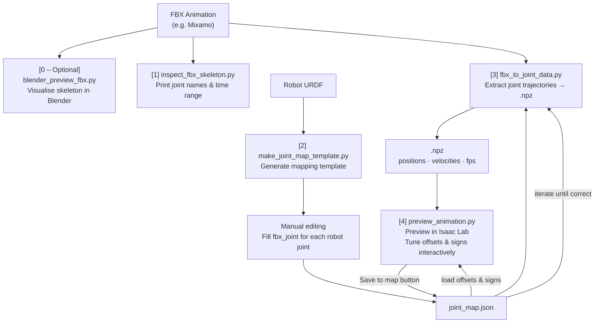
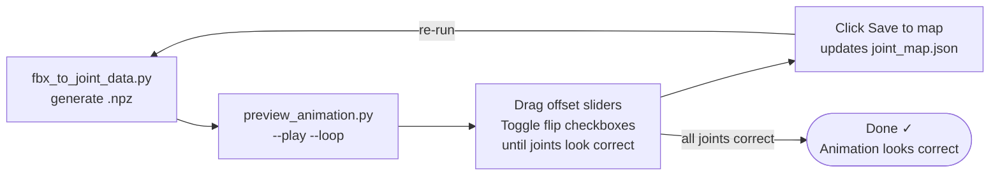

# FBX Motion References for Robotics

A toolkit for extracting motion capture animations from FBX files and retargeting them to robot joint trajectories - ready to use as motion references for reinforcement learning.

Built around the [Mixamo](https://www.mixamo.com) → [Isaac Lab](https://isaac-sim.github.io/IsaacLab/) pipeline, but designed to work with any FBX skeleton and any robot URDF.

---

## Pipeline Overview



> Steps 3 → 4 → edit map → 3 are meant to be **repeated iteratively** until the retargeted animation looks correct on your robot.

---

## Requirements

### Isaac Lab (core dependency)

All scripts except the Blender one require [Isaac Lab](https://isaac-sim.github.io/IsaacLab/) (which bundles Isaac Sim, PyTorch, and Pixar USD).

**Install Isaac Lab:** follow the [official installation guide](https://isaac-sim.github.io/IsaacLab/main/source/setup/installation/index.html).

Once Isaac Lab is installed, activate its Python environment and install the one extra dependency:

```bash
# Activate Isaac Lab's Python (adjust path to your install)
source /path/to/isaaclab/.venv/bin/activate

# Install requirements
pip install -r requirements.txt
```

`tkinter` is required for `preview_animation.py` and usually ships with Python. If it is missing:

```bash
# Ubuntu/Debian
sudo apt install python3-tk
```

### Blender (optional, step 0 only)

[Blender 3.6+](https://www.blender.org/download/) - uses its own bundled Python; no `pip install` needed.

---

## Quickstart

### [Optional] Step 0 - Inspect the skeleton in Blender

> **Do this first** if you are unfamiliar with the FBX skeleton hierarchy. Blender lets you visually identify which bone corresponds to which body part before you write the joint map.

```bash
blender --python src/blender_preview_fbx.py -- --fbx path/to/animation.fbx
```

Opens the FBX in Blender, plays the animation, and overlays every joint name in the 3D viewport.

Optional flags: `--scale 0.01`, `--fps 30`

---

### Step 1 - Get the joint list from the FBX

```bash
python src/inspect_fbx_skeleton.py --fbx path/to/animation.fbx --headless
```

Prints all skeleton joint names and the animation time range. Copy the joint names you need into your map in step 2.

> **If FBX conversion fails** (Isaac Lab's converter can be fragile with some exporters), convert the FBX to USD manually through the Isaac Sim GUI:
>
> 1. Launch Isaac Sim.
> 2. Go to **File → Import** and select your `.fbx` file.
> 3. Isaac Sim will convert and open it as a USD stage.
> 4. Go to **File → Save As** and save it as a `.usd` file.
> 5. Use the resulting USD file with `--usd` instead of `--fbx` in all subsequent commands.

---

### Step 2 - Generate a joint mapping template

```bash
python src/make_joint_map_template.py \
    --urdf path/to/Robot.urdf \
    --out  processed/my_robot_map.json
```

Produces a JSON file with one entry per revolute joint in your URDF. Edit it manually to fill in the `fbx_joint` path for each robot joint (copy-paste from step 1 output).

**Entry format:**

```json
{
  "robot_joint": "r_hip_y",
  "fbx_joint": "mixamorig_Hips/mixamorig_RightUpLeg",
  "euler_component": "x",
  "euler_order": "XYZ",
  "sign": -1.0,
  "offset_deg": 0.0,
  "scale": 1.0
}
```

| Field | Description |
|---|---|
| `robot_joint` | Joint name as it appears in the URDF |
| `fbx_joint` | Slash-separated path to the FBX bone (from step 1) |
| `euler_component` | `"x"`, `"y"`, or `"z"` - which Euler angle component to extract (recommended) |
| `euler_order` | Rotation order; only `"XYZ"` supported |
| `axis` | Rotation axis vector - used as fallback when `euler_component` is omitted |
| `sign` | `1.0` or `-1.0` - flip joint direction if needed |
| `offset_deg` | Constant offset in degrees added after extraction |
| `scale` | Multiplicative scale applied to the extracted angle |

A complete example (Mixamo → 12-DOF biped) is in `processed/joint_map_template.json`.

---

### Step 3 - Extract joint trajectories

```bash
python src/fbx_to_joint_data.py \
    --fbx       path/to/animation.fbx \
    --joint-map processed/my_robot_map.json \
    --out       processed/animation.npz \
    --headless
```

Using a pre-converted USD instead of FBX:

```bash
python src/fbx_to_joint_data.py \
    --usd       path/to/animation.usd \
    --joint-map processed/my_robot_map.json \
    --out       processed/animation.npz \
    --headless
```

Optional flags:

| Flag | Description |
|---|---|
| `--fps N` | Resample the animation to N frames per second |
| `--force` | Force re-conversion of the FBX file |
| `--usd-out path` | Save the converted USD to a specific path |

**Output NPZ format:**

```python
data = np.load("processed/animation.npz", allow_pickle=True)
data["joint_names"]  # (J,)          joint name strings
data["positions"]    # (T, J) float32 joint angles in radians
data["velocities"]   # (T, J) float32 angular velocities (rad/s)
data["fps"]          # scalar         frames per second
data["dt"]           # scalar         time step (seconds)
data["source_usd"]   # str            USD file used
data["source_fbx"]   # str            FBX source (if converted)
```

---

### Step 4 - Preview and tune interactively

Set your robot USD path once in `config.yaml`:

```bash
cp config.example.yaml config.yaml
# edit config.yaml → set robot_usd: /path/to/robot.usd
```

Then run the preview, passing the same joint map used for extraction:

```bash
python src/preview_animation.py \
    --npz       processed/animation.npz \
    --joint-map processed/my_robot_map.json \
    --play --loop
```

The interactive panel loads the current `offset_deg` and `sign` values from the map and lets you tune them live:

- **FPS slider** - change playback speed
- **Per-joint offset sliders** (±180°) - shift a joint angle up or down
- **Flip checkboxes** - invert a joint's direction
- **Save to map** button - writes the current slider values back to `my_robot_map.json`

After saving, re-run step 3 to regenerate the `.npz` with the updated offsets. Repeat until the animation looks correct.

> **Tip:** pass `--no-freeze-base` to let the robot fall freely and check that foot contact looks natural.

---

## Iterative Tuning Workflow

Getting the joint map right usually takes a few passes:



---

## Repository Layout

```
robot-motion-reference/
├── src/
│   ├── inspect_fbx_skeleton.py      # Step 1: inspect FBX/USD skeleton
│   ├── make_joint_map_template.py   # Step 2: generate joint mapping template
│   ├── fbx_to_joint_data.py         # Step 3: extract joint trajectories
│   ├── preview_animation.py         # Step 4: preview in Isaac Lab + tune
│   └── blender_preview_fbx.py       # Step 0 (optional): inspect skeleton in Blender
├── processed/
│   ├── joint_map_template.json      # Example: Mixamo → 12-DOF biped mapping
│   └── StandardWalk.npz             # Example: processed walking animation
├── config.example.yaml              # Copy to config.yaml and fill in robot_usd
├── requirements.txt
└── LICENSE
```

---

## Tips

- **Start with Blender** (step 0) to see all bone names before writing the joint map - much faster than trial and error.
- **Use `euler_component`** rather than axis-projection for Mixamo skeletons; it is more reliable.
- **`config.yaml` is gitignored** - each user keeps their own local copy with their own paths.
- **FBX conversion requires a GPU.** If you are on a headless machine, pass `--headless` and make sure an NVIDIA GPU is available. If conversion still fails, export the USD manually from the Isaac Sim GUI (see step 1).

---

## License

[MIT](LICENSE)
